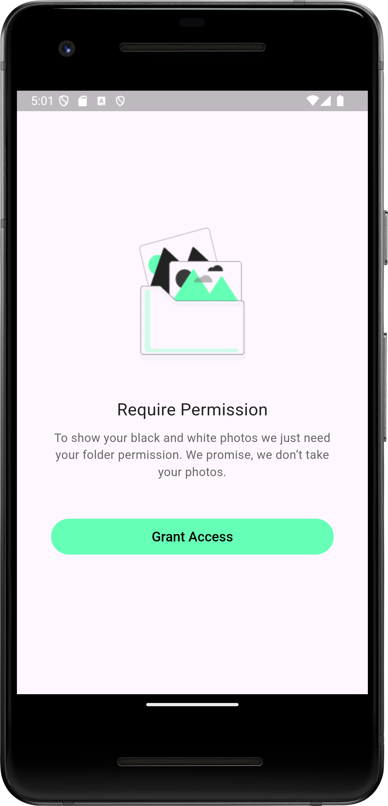
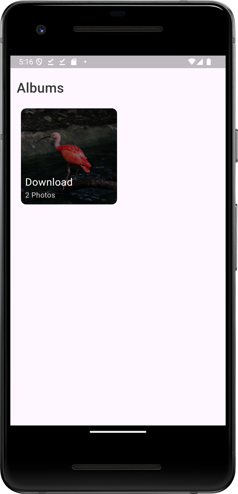
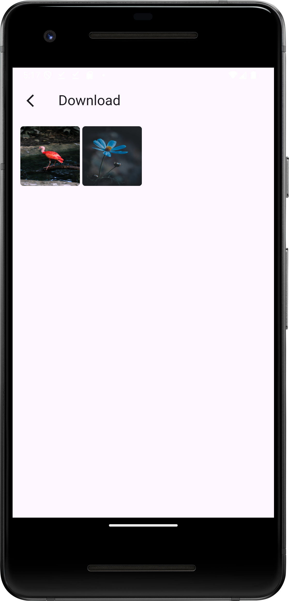
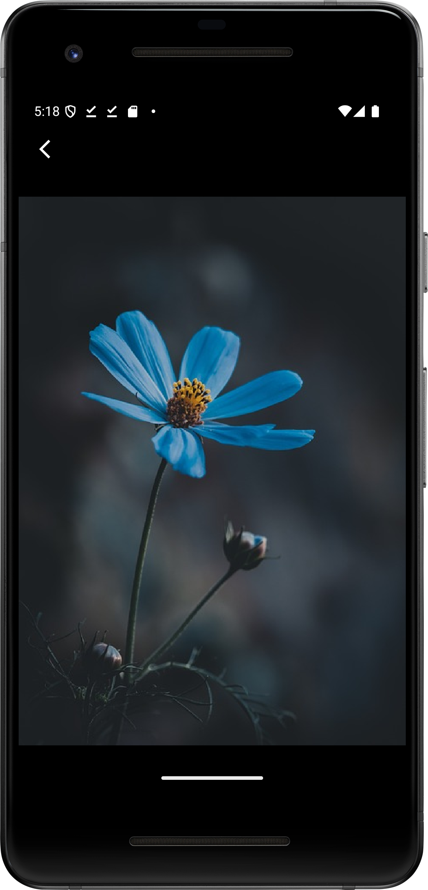

# Photo Gallery Flutter App

## Description

The **Photo Gallery Flutter App** is a cross-platform mobile application designed to provide users with an intuitive and
organized photo viewing experience. The app includes core features such as Albums, Photos, and a Full-Screen View, all
while adhering to clean architecture principles to ensure maintainability and scalability.

## Features

- **Albums**: Organize photos into albums for easy navigation.
- **Photos**: Display a collection of photos with smooth scrolling and optimized performance.
- **Full-Screen View**: View individual photos in a full-screen mode with gestures for navigation.

## Architecture and Tools

- **Clean Architecture**: Ensures separation of concerns and scalability by dividing the app into layers (Presentation,
  Domain, Data).
- **State Management**: Uses [Flutter Bloc](https://bloclibrary.dev/) to manage the state efficiently and handle
  business logic.
- **Native Communication**: Uses [Pigeon](https://pub.dev/packages/pigeon) for seamless communication with the native
  side of the app.
- **Dependency Injection**: Implements [Get It](https://pub.dev/packages/get_it) for managing dependencies.
- **Testing**: Uses [Mockito](https://pub.dev/packages/mockito) and [bloc_test](https://pub.dev/packages/bloc_test) to
  write robust unit tests.